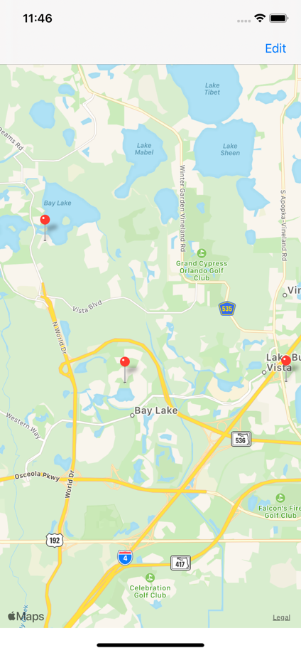
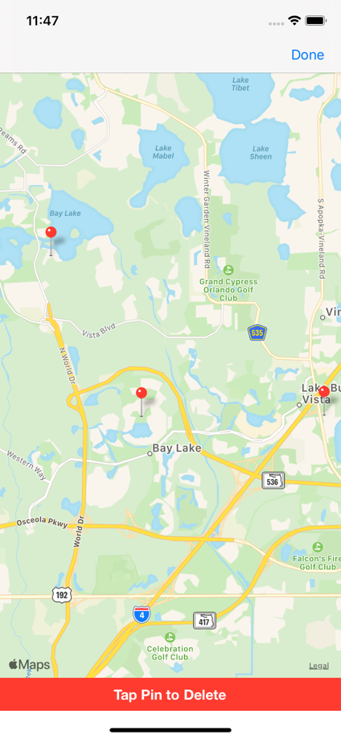
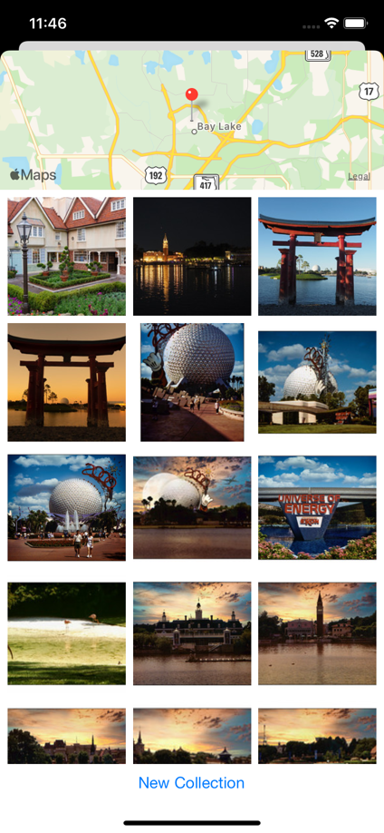

# Virtual Tourist

### Project Overview (via Udacity)

The Virtual Tourist app downloads and stores images from Flickr. The app allows users to drop pins on a map, as if they were stops on a tour. Users will then be able to download pictures for the location and persist both the pictures, and the association of the pictures with the pin.

### Usage

The Flickr API in the FlickrClient.swift file must be updated for functionality. You can request one from Flickr, or generate one by suppling sufficient search criteria (lat, lon, radius) and parsing it from return URL generated during a test search here: https://www.flickr.com/services/api/explore/flickr.photos.search

### Images

The homescreen of the app is a MapKit view where a gesture recognizer drops a pin on the map from a long press. The navigation button allows users to delete pins and via code, the associated images saved to CoreData.

 

The modally presented view controller displays a map to show the pin's location, and retrieves up to 21 images from flickr. The pictures are from a random results page and the user can fetch additional images by selecting "new collection."

